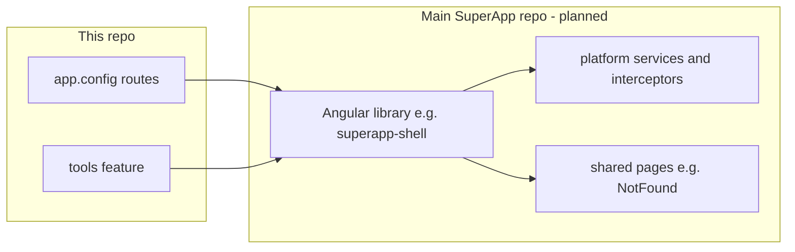

# Integrating the Tools app with the parent SuperApp

This repository is the **Tools** area of the SuperApp product: an Angular 19 app that ships as static assets (`npm run build` → `dist/superapp/`). The **parent SuperApp** is the shell that owns global navigation, identity, and platform services.

**Audience**

- **Platform engineers** wiring this build into the shell (deployment, DI, registry, observability).
- **Contributors** planning how shared platform code moves into a shell library (see [Shared shell library](#8-shared-shell-library-planned)).

---

## How the pieces fit together

| Layer | Role |
|-------|------|
| **This repo today** | Local implementations under `src/app/platform/` (and a minimal not-found page) so the app runs standalone. |
| **Host embedding** | Replace those services in `ApplicationConfig` with real implementations that talk to your SSO, analytics, audit, etc. Same tokens and public APIs either way. |
| **Planned** | Canonical platform + shared pages may live in an Angular library published from the main SuperApp repo; this repo would depend on that package and delete duplicate sources. **Hosts still override providers** for production identity and backends. |

---

## 1. What you are embedding

| Item | Detail |
|------|--------|
| **Artifact** | Production build output: `dist/superapp/` (browser bundle + `assets/`) |
| **Primary routes** | `/` redirects to `/tools`; catalog at `/tools`; in-app tools at `/tools/:toolId`; missing tools → `/not-found` |
| **Package name** | `superapp` (see root `package.json`) |

The host must serve these files and preserve client-side routing for paths under `/tools` (see [Routing and base URL](#5-routing-and-base-url)).

---

## 2. Integration shapes

Choose one deployment pattern; the platform contracts below apply to all of them.

### A. Same origin, sub-path (recommended for a unified SPA)

Deploy the build so the app is served at a prefix (for example `https://company.example/superapp-tools/`). Configure Angular **`--base-href`** (and matching **`deployUrl`** if you split chunks) so asset URLs and the router resolve correctly. The shell’s router should lazy-load or navigate into this app’s routes without full page reloads if you combine bundles.

### B. Same origin, reverse proxy path

The host reverse-proxy maps a path (for example `/tools-app/`) to the static root of `dist/superapp`. Set **`base-href`** to that path in the build.

### C. Separate micro-frontend origin

Serve `dist/superapp` on its own origin (for example `https://tools.company.example`). Configure **CORS** for the registry API if it lives on another origin. **Deep links** to `/tools/...` must hit this origin unless the shell rewrites URLs.

---

## 3. Platform services (replace in the host)

Code under **`src/app/platform/`** is a thin façade so the Tools app runs standalone. For a real SuperApp deployment, **provide your own implementations** of the same public APIs (or wrap the defaults and delegate to the host). If this repo later consumes a **`@scope/superapp-shell`** (or similar) package, those types and tokens remain the same—**`{ provide: SomeService, useClass: HostSomeService }`** still applies.

Register replacements in your bootstrap **`ApplicationConfig`** (see `src/app/app.config.ts`): use **`{ provide: SomeService, useClass: HostSomeService }`** (or `useFactory`) so the rest of the app keeps injecting the same tokens.

### `AuthService` (`auth.service.ts`)

| Responsibility | Methods / behavior |
|----------------|-------------------|
| Identity | `getUserId()`, `getUserIdSnapshot()` — used for audit and analytics context |
| API calls | `getAccessToken()` — when non-null, **`authInterceptor`** adds `Authorization: Bearer …` to **all** `HttpClient` requests (including the tools registry API) |
| Session | `assertAuthenticated()` — called when an in-app tool loads (`ToolScaffoldComponent`); default is a no-op |
| Sign-in UX | `redirectToLogin()` — default navigates to `/login` (ensure your host route exists or override) |

**Host action:** Connect to your SSO/session layer; return real user ids and bearer tokens for registry and future APIs.

### `UserPrefsService` (`user-prefs.service.ts`)

Persists **favorite tool ids** in **`localStorage`** under the key `tools.favorites`.

**Host action:** If prefs must follow the user across devices, replace with a server-backed or host-synced store while keeping the same observable API.

### `TeamToolFavoritesService` (`team-tool-favorites.service.ts`)

Exposes **team-favorited tool ids** for the catalog **My Team** scope (`getTeamFavoriteToolIds()` → `Observable<Set<string>>`, plus `snapshotTeamFavorites()`). The default implementation emits an **empty set** (standalone).

**Host action:** Replace with an implementation that loads favorites for the current team from your SuperApp org/team APIs (or shared shell), keeping the same observable API.

### `AnalyticsService` (`analytics.service.ts`)

| Method | When it fires |
|--------|----------------|
| `track(event, props)` | Tool launches, card views, etc. |
| `trackPageView(toolId)` | In-app tool host / scaffold |

**Host action:** Forward to your analytics pipeline (for example Elastic, Segment, internal ingest).

### `AuditService` (`audit.service.ts`)

Emits structured events: `tool.view`, `tool.launch`, `tool.enter`, `tool.exit` (with `durationMs` on exit). Payloads include `toolId`, `userId`, `timestamp`, and optional `url` / `durationMs`.

**Host action:** POST to your audit API or append to your compliance log.

### `ErrorService` (`error.service.ts`)

Implements Angular’s **`ErrorHandler`** and is registered in **`app.config.ts`** as `ErrorHandler`. Also exposes **`capture(error, context)`** for explicit reporting (for example scaffold config mismatch).

**Host action:** Send to your error reporting (Sentry, etc.).

### `authInterceptor` (`auth.interceptor.ts`)

Functional interceptor; no separate registration beyond **`provideHttpClient(withInterceptors([authInterceptor]))`**. It only reads **`AuthService.getAccessToken()`**—no separate host hook.

### Branding (`branding-bar.component.ts`)

Used inside **`sa-tool-scaffold`** for per-tool chrome (title + version). The **main shell** (`AppComponent`) has its own header (“SuperApp”, nav, avatar placeholder).

**Host action:** If the parent already renders global chrome, you may remove or replace the **`AppComponent`** header in this repo, hide **`sa-branding-bar`** in scaffold, or style both to match the host—there is no runtime flag; use code or CSS in your fork/build.

---

## 4. Code layout today (and what may move to a library)

- **`src/app/platform/`** — Standalone pieces: `AuthService`, `UserPrefsService`, `AnalyticsService`, `AuditService`, `ErrorService`, `authInterceptor`, and `BrandingBarComponent`. Wired in `app.config.ts` and imported from `src/app/tools/`.
- **`src/app/pages/`** — `not-found-page.component.ts`, lazy-loaded for `/not-found` (referenced by `tool-route.guard.ts` and `tool-host.component.ts`).
- **Stays in this vertical** — `tools-page.component.ts` (catalog) is not targeted for extraction unless the main app explicitly owns that UI.

---

## 5. Routing and base URL

- **Canonical in-app paths** are `/tools` and `/tools/:toolId`. **`ToolLaunchService`** builds absolute URLs with **`Location.prepareExternalUrl`**, so **`APP_BASE_HREF`** / **`--base-href`** must match how the host serves the app.
- The server (or CDN) must answer **`GET`** requests for deep links (for example `/tools/some-tool`) with **`index.html`** (SPA fallback), not `404`.

---

## 6. Configuration and registry

| Source | Role |
|--------|------|
| **`environment.toolsRegistryApiUrl`** | If set, **`ToolRegistryService`** `GET`s this URL first (JSON array of `ToolDefinition`). On failure, falls back to the asset. |
| **`environment.toolsRegistryAssetUrl`** | Default `/assets/tools-registry.json` under the deployed site root. |

Set production values in **`src/environments/environment.prod.ts`** or via your CI replace strategy. The registry API receives the **Bearer** token when **`AuthService.getAccessToken()`** is set.

---

## 7. Checklist for the host team

1. **Static hosting** — Deploy `dist/superapp` with correct **`base-href`** and SPA fallback for `/tools/**`.
2. **Auth** — Implement **`AuthService`** (user id + optional bearer token); **`assertAuthenticated`** / **`redirectToLogin`** aligned with your session model.
3. **Registry** — Configure **`toolsRegistryApiUrl`** (and auth as needed) or ship an updated **`tools-registry.json`**.
4. **Observability** — Wire **`AnalyticsService`**, **`AuditService`**, and **`ErrorService`** to platform backends.
5. **UX** — Resolve duplicate top-level chrome vs **`AppComponent`** / **`sa-branding-bar`** for your shell layout.

For **adding tools** and in-app route registration (`TOOL_HOST_COMPONENTS`), see **[`getting-started/README.md`](../getting-started/README.md)**.

---

## 8. Shared shell library (planned)

No code changes land in this repo until the main SuperApp repo ships a consumable package (or a verifiable `file:` path for integration testing). The goal is to **deduplicate** platform + not-found with the main app, not to change how hosts integrate: **provider overrides in `app.config.ts` stay the contract.**

### Phase A — Main SuperApp repository (prerequisite)

1. **Add an Angular library** (e.g. `ng generate library superapp-shell` or `@scope/superapp-shell`) with standalone components/services aligned with Angular 19, matching dependency versions used here (`@angular/core` ^19.x, etc.).
2. **Move or re-export** canonical implementations with the **same public method signatures** as today’s stubs so Tools changes are mostly import paths:
   - Services: auth, user prefs, analytics, audit, error handling.
   - `authInterceptor` (functional interceptor, as in `auth.interceptor.ts`).
   - `BrandingBarComponent` if the shell owns chrome; otherwise document a minimal bar for Tools-only layouts.
   - **`NotFoundPageComponent`** (or equivalent) for shared 404 UX.
3. **Public API** — `public-api.ts` (or secondary entry points for `platform` vs `pages`) so consumers import from stable paths, e.g. `@scope/superapp-shell` / `@scope/superapp-shell/pages`.
4. **Publish or link** — Private npm, Verdaccio, or `file:` / workspace path for local dev. Document the package name and minimum version for Tools.

**Contract:** Export `ToolLaunchSource` (or equivalent) from the analytics module — it is imported by `tool-launch.service.ts`.

### Phase B — This repository

1. Add the library to **`package.json`** and install; add **`tsconfig.app.json`** path mapping only if required (usually not for a proper npm package).
2. **Replace imports** — `../../platform/...` and `./platform/...` → the package’s public paths. Lazy route for not-found: import from the shared package (keep route path `/not-found` so guards and redirects stay valid).
3. **Delete** local `src/app/platform/` and `src/app/pages/not-found-page.component.ts` after tests pass.
4. **Tests** — Update spec imports (e.g. `tools-section.component.spec.ts`, `tool-launch.service.spec.ts`, and any `../../platform/` references).
5. **README** — Document the dependency on `@scope/superapp-shell`, link to main repo docs, and how to run against a linked build during development.

### Risks and alignment

- **Version drift** — Pin the shell library to the same Angular major as this app; use Renovate/Dependabot or a single release train across repos.
- **App shell duplication** — `app.component.ts` embeds its own header/nav; the main app may later provide a shell component from the same library. Optional follow-up; not required to dedupe platform + not-found.

### Implementation checklist

- [ ] **Main repo:** Angular library with platform + NotFound exports and publish/link strategy
- [ ] **This repo:** package dependency + replace all platform/not-found imports
- [ ] Delete `src/app/platform` and `src/app/pages/not-found`; fix tests and README

---

## 9. Related files

| Path | Purpose |
|------|---------|
| `src/app/app.config.ts` | Router, HTTP interceptors, `ErrorHandler` |
| `src/app/platform/` | Platform façades (or future package imports), including `team-tool-favorites.service.ts` |
| `src/environments/environment*.ts` | Registry URLs |
| `src/app/tools/services/tool-launch.service.ts` | Launch URLs, audit/analytics on open |
| `src/app/tools/components/tool-scaffold.component.ts` | Entry/exit audit, page view, auth gate |
